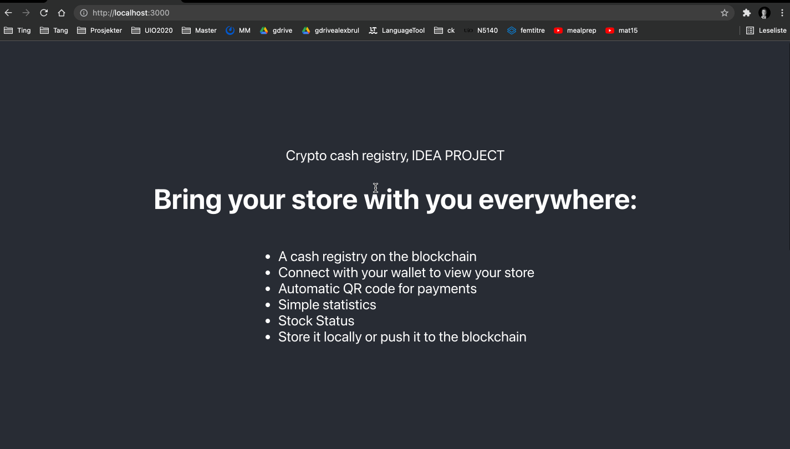

1) yarn
2) yarn start
3) tmp -> disable CORS. 

# Online store management and payment system
## Introduction
The global south includes huge areas where access to stable connections are lacking. Small businesses are very low-tech, and their socio-economic situation reflects the local need for low entry business management solutions. While there currently are physical cash registry alternatives, these often require a fee for recieving paymenets through Mastercard etc, and a subscription, which small businesses shouldn't have to pay. 

## Proposal
I propose an open source - low entry, alternative that can benefit all kind of local businesses. It will allow them to recieve paymetns through the blockchain, but also keeping their store inventory and statistics under control. 

